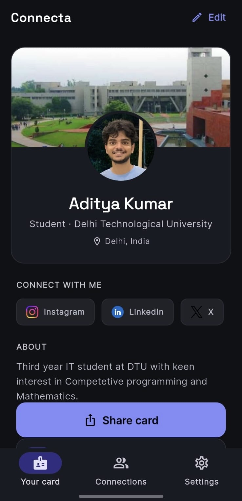
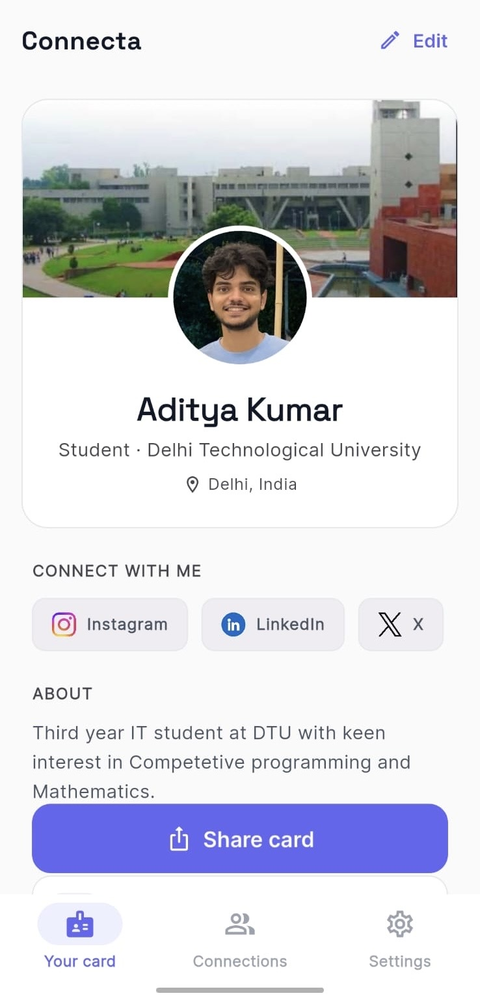
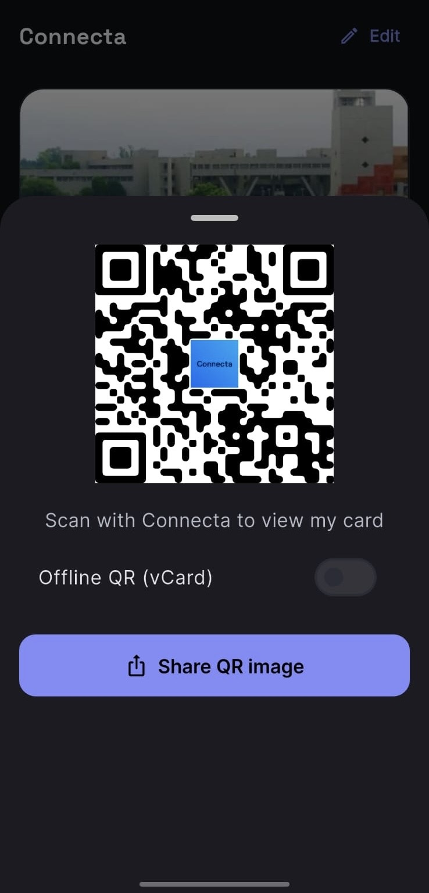
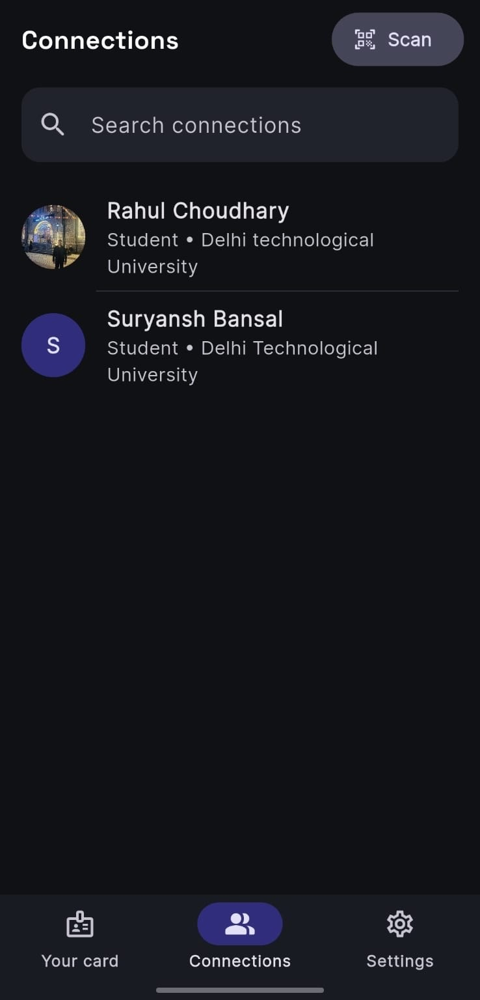
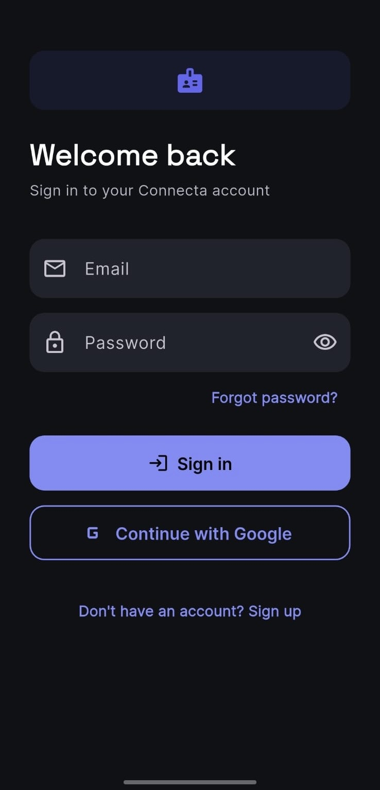
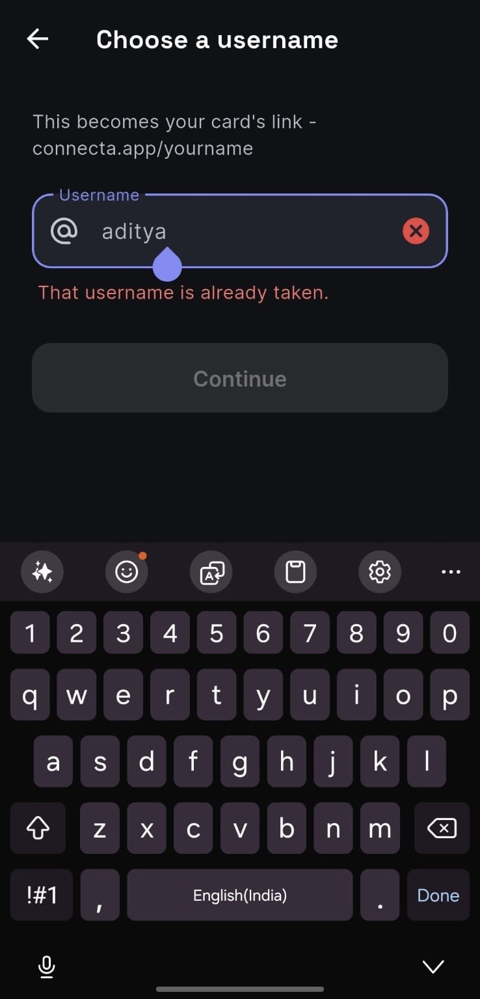

<div align="center">


# Connecta

### Digital business cards, reimagined.

Claim a username, build a rich profile card, and share it instantly by QR code or deep link — no paper required.

[](https://flutter.dev)
[](https://dart.dev)
[](https://supabase.com)
[](https://riverpod.dev)
[](https://flutter.dev)
[](LICENSE)

</div>

---

## 📸 Screenshots

<div align="center">

| Your Card (dark) | Your Card (light) | Share & QR |
|:---:|:---:|:---:|
|  |  |  |
| **Connections** | **Sign In** | **Claim Username** |
|  |  |  |

</div>

---

## 📑 Table of Contents

- [Overview](#-overview)
- [Features](#-features)
- [Tech Stack](#-tech-stack)
- [Architecture](#-architecture)
- [Security Model](#-security-model)
- [Project Structure](#-project-structure)
- [Getting Started](#-getting-started)
- [Building for Release](#-building-for-release)
- [Roadmap & Known Limitations](#-roadmap--known-limitations)
- [Contributing](#-contributing)
- [License](#-license)

---

## 🔍 Overview

**Connecta** is a mobile-first digital business card app built with Flutter. Each user claims a globally unique username, composes a card with their contact details, links, socials, bio and a scheduling link, then shares it as a scannable QR code or a `connecta://` deep link. Meeting someone in person is a two-tap flow: scan their code, exchange contacts, and you're both connected.

The backend is [Supabase](https://supabase.com) — Postgres, Auth, Storage and Edge Functions — with **Row Level Security enforcing every access rule at the database layer** rather than in client code. No secrets are committed to the repository; credentials are injected at build time.

This repo is the mobile client plus the database schema and edge function that back it.

---

## ✨ Features

- 🪪 **Rich digital cards** — Contact info, job title, organisation, bio, custom links, social handles, and a scheduling link, all editable in-app.
- 🔑 **Unique usernames** — Claim a globally unique handle; your card lives at a shareable link tied to it, with live availability checking during onboarding.
- 🔗 **QR & deep-link sharing** — Generate a branded QR (profile link or an offline vCard), or share a `connecta://profile/<username>` deep link that opens straight to your card.
- 🤝 **Mutual connections** — Scan someone's code to exchange contacts; both sides get a connection in a single atomic operation, and either can save the other straight to their phone's contacts.
- 🔒 **Secure auth** — Email/password with a mandatory verification step, plus one-tap Google Sign-In. Password reset over deep link.
- 🌙 **Light & dark mode** — Full theming driven by system preference or a manual toggle, persisted per account.
- ☁️ **Supabase-backed** — Postgres + RLS, Storage for images (uploaded off the UI thread with automatic downscaling), and Edge Functions for privileged operations like account deletion.

---

## 🛠 Tech Stack

| Layer | Technology |
|---|---|
| **UI framework** | [Flutter](https://flutter.dev) 3.x · Dart 3.x |
| **State management** | [Riverpod 2](https://riverpod.dev) — `StateNotifierProvider`, `FutureProvider`, `StreamProvider` |
| **Backend & database** | [Supabase](https://supabase.com) — Postgres with Row Level Security |
| **Authentication** | Supabase Auth (email/password + Google Sign-In via `google_sign_in`) |
| **Image storage** | Supabase Storage (`profile-assets` bucket) — client-side resize/compress via the `image` package |
| **Serverless** | Supabase Edge Functions (Deno) — secure account deletion |
| **Deep links** | Custom `connecta://` URI scheme via `app_links` |
| **QR codes** | `mobile_scanner` (scan) · `pretty_qr_code` (generate) |
| **Other** | `cached_network_image`, `share_plus`, `url_launcher`, `google_fonts` |
| **Platforms** | Android · iOS |

---

## 🏛 Architecture

State flows one way: Supabase is the source of truth, Riverpod providers derive UI state from it, and screens are thin consumers.

- **A derived auth state machine.** `authStateProvider` composes the auth session, profile existence, and any pending deep link into a single `AuthState` enum (`loading · notLoggedIn · needsOnboarding · redirectingToProfile · complete · error`). The root `AuthGate` simply switches on it — there is no imperative navigation for auth. A single shared `StreamProvider` on `onAuthStateChange` is the one place the app subscribes to "who is logged in."

- **Interface-based auth layer.** `AuthProvider` is an abstract interface; `SupabaseAuthProvider` is the concrete implementation, and it maps vendor `AuthException`s into a domain-specific exception set (`WrongPasswordAuthException`, `EmailNotConfirmedException`, …). Swapping the backend is a one-line factory change in `auth_service.dart`.

- **Mutual connections via `SECURITY DEFINER` RPCs.** The `connections` table has **no direct write policy**. All mutations go through Postgres functions (`exchange_contacts`, `delete_connection`) that run with definer privileges, verify the caller, and write both sides of the relationship atomically. See [Security Model](#-security-model).

- **Custom-scheme deep linking.** `connecta://profile/<username>` links are resolved to a profile in `main.dart` and fed into the same provider that drives `AuthState.redirectingToProfile`. This listener coexists with Supabase's own auth-redirect handler on the same scheme; each ignores URIs meant for the other.

- **Build-time credentials.** The Supabase URL, anon key and Google client ID are injected via `--dart-define-from-file` and read with `String.fromEnvironment()`. They never appear in source. The app asserts on startup with a clear message if they're missing.

- **Off-thread image processing.** Profile and cover images are decoded, downscaled (long edge capped) and re-encoded in a background isolate via `compute()`, so large photos never block the UI thread.

---

## 🔐 Security Model

Security is enforced in the database, not the client. The anon key shipped in the app is intentionally public — it grants nothing that RLS doesn't explicitly allow.

- **`profiles`** — publicly readable (cards are meant to be shared); writable only by the owner (`auth.uid() = id`).
- **`connections`** — a user can read only their own rows, and there is **no** direct insert/update/delete policy. Writes happen exclusively through `SECURITY DEFINER` RPCs that authenticate the caller, reject self-connections, and keep both directions of the relationship in sync. Execution is revoked from `anon` and granted only to `authenticated`.
- **Storage** — the `profile-assets` bucket is public-read, but writes are scoped so a user can only touch files under their own `uid/` prefix.
- **Account deletion** — runs in a Deno Edge Function invoked with the user's JWT. It verifies the token server-side, removes the user's storage files, then deletes the auth user, which cascades to the profile and all connections via foreign keys.
- **Cascade integrity** — `connections` and `profiles` are wired with `ON DELETE CASCADE`, so deleting an account can't leave dangling rows on either side of a relationship.

The full schema — tables, policies, RPCs and storage rules — lives in a single reviewable file: [`supabase/migrations/0001_init.sql`](supabase/migrations/0001_init.sql).

---

## 📁 Project Structure

```
mobile-app/
├── lib/
│   ├── main.dart                   # Entry point: Supabase.initialize(), deep-link wiring
│   ├── models/                     # Pure data classes (UserData, Connection, AppSettings)
│   ├── providers/                  # Riverpod providers (auth, user, connections, settings)
│   ├── screens/
│   │   ├── authenticate/           # Login, sign-up, password reset
│   │   ├── onboarding/             # Welcome + username claim
│   │   ├── editing_card/           # Card editing (contact, links, about, socials, scheduling)
│   │   └── main_4_navigations/     # Bottom-nav screens + settings sub-screens
│   ├── services/
│   │   ├── auth/                   # AuthProvider interface + SupabaseAuthProvider
│   │   └── storage/                # Image upload / resize / compress
│   ├── utilities/                  # Theme, constants, URL + vCard helpers, config
│   └── widgets/                    # Reusable UI (cards, bottom sheets, snackbars)
│
├── supabase/
│   ├── migrations/0001_init.sql    # Full schema: tables, RLS, storage bucket, RPCs
│   └── functions/delete-account/   # Deno Edge Function — secure account deletion
│
├── android/ · ios/                 # Native host projects
├── assets/                         # App logo, social/nav icons, default images
├── docs/screenshots/               # README screenshots
├── .env.json.example               # Credential template — copy to .env.json
└── pubspec.yaml
```

---

## 🚀 Getting Started

### Prerequisites

- [Flutter SDK](https://docs.flutter.dev/get-started/install) `>= 3.8.1` (bundles the matching Dart SDK)
- [Android Studio](https://developer.android.com/studio) and/or [Xcode](https://developer.apple.com/xcode/) for emulators and device deployment
- A [Supabase](https://supabase.com) account (free tier is enough)
- A [Google Cloud Console](https://console.cloud.google.com) project with OAuth 2.0 credentials, only if you want Google Sign-In

Confirm your toolchain is healthy:

```bash
flutter doctor
```

### 1. Clone and install

```bash
git clone https://github.com/<your-username>/connecta.git
cd connecta/mobile-app
flutter pub get
```

### 2. Set up Supabase

> ⚠️ Real credentials are never committed. You must connect your own Supabase project before the app will run.

**a. Create a project** at [supabase.com](https://supabase.com) and note your **Project URL** and **anon public key** from *Project Settings → API*.

**b. Run the migration** — open the dashboard **SQL Editor** and run the full contents of [`supabase/migrations/0001_init.sql`](supabase/migrations/0001_init.sql). This creates the `profiles`, `connections` and `support_feedback` tables, all RLS policies, the `profile-assets` storage bucket, and the `exchange_contacts` / `delete_connection` RPCs.

**c. Configure Google Sign-In** *(optional)* — in *Authentication → Providers → Google*, add your OAuth Client ID and Secret. See the [Supabase Google Auth guide](https://supabase.com/docs/guides/auth/social-login/auth-google).

**d. Configure redirect URLs** — in *Authentication → URL Configuration*:

| Field | Value |
|---|---|
| Site URL | `connecta://login-callback` |
| Redirect URLs | `connecta://login-callback` |

This lets verification and password-reset emails reopen the app on both platforms.

**e. Deploy the Edge Function** — install the [Supabase CLI](https://supabase.com/docs/guides/cli), then:

```bash
npx supabase login
npx supabase link --project-ref <your-project-ref>
npx supabase functions deploy delete-account
```

### 3. Add local credentials

```bash
cp .env.json.example .env.json
```

Fill in `.env.json`:

```json
{
  "SUPABASE_URL": "https://your-project-ref.supabase.co",
  "SUPABASE_ANON_KEY": "your-anon-public-key-here",
  "GOOGLE_WEB_CLIENT_ID": "your-web-oauth-client-id.apps.googleusercontent.com"
}
```

> `.env.json` is git-ignored and never committed. The anon key is safe on the client — all security is enforced by Row Level Security, not by hiding this key. `GOOGLE_WEB_CLIENT_ID` can be left as the placeholder if you're not using Google Sign-In.

### 4. Run

```bash
flutter run --dart-define-from-file=.env.json
```

> ⚠️ **Every run needs the `--dart-define-from-file=.env.json` flag** — without it the app asserts on startup. Configure it once in your IDE so you never forget:
>
> **VS Code** — in `.vscode/launch.json`:
> ```json
> {
>   "configurations": [
>     {
>       "name": "Connecta",
>       "request": "launch",
>       "type": "dart",
>       "args": ["--dart-define-from-file=.env.json"]
>     }
>   ]
> }
> ```
>
> **Android Studio** — *Run → Edit Configurations → Additional run args*:
> ```
> --dart-define-from-file=.env.json
> ```

---

## 📦 Building for Release

```bash
# Android APK
flutter build apk --release --dart-define-from-file=.env.json

# Android App Bundle (for Play Store)
flutter build appbundle --release --dart-define-from-file=.env.json

# iOS
flutter build ipa --release --dart-define-from-file=.env.json
```

Release Android builds are signed from a `key.properties` file in `android/` (git-ignored). See the [Flutter app-signing guide](https://docs.flutter.dev/deployment/android#signing-the-app) to set one up.

---

## 🗺 Roadmap & Known Limitations

Honest notes on where the project stands — it's a portfolio/beta app, not a production service.

- **Deep links require the app installed.** `connecta://` links only resolve on a device that already has Connecta; there is no web fallback or store deep-link deferral yet.
- **No automated tests.** There is currently no unit/widget/integration test coverage — a known gap.
- **Planned**: connection notes, richer analytics, and a lightweight web card viewer.

---

## 🤝 Contributing

Contributions are welcome:

1. Fork the repo
2. Create a feature branch — `git checkout -b feature/your-feature`
3. Commit your changes — `git commit -m "Add some feature"`
4. Push — `git push origin feature/your-feature`
5. Open a Pull Request

Please make sure `flutter analyze` reports no errors before submitting.

---

## 📄 License

Licensed under the MIT License. See [LICENSE](LICENSE) for details.

---

<div align="center">
  Built with Flutter &amp; Supabase.
</div>
